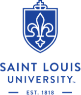

<!-- Generated by README.Rmd: editing is futile -->

# samplr 

[](https://github.com/schuelkem/samplr/)
[](https://github.com/schuelkem/samplr/)
[](https://github.com/schuelkem/samplr/commits/master)

## Overview
This [R](https://cloud.r-project.org) package was created to fulfill course requirements of [Saint Louis University](https://www.slu.edu) [MATH 4800: Probability Theory](http://stat.slu.edu/~speegled/Fall2018/4800/schedule.html) for the Fall 2018 semester. The purpose of the package is to sample from continuous distributions given their probability density functions.

## Install Package
You can install this package by using `devtools`:

```r
devtools::install_github("schuelkem/samplr", build_vignettes = TRUE)
```

## About

### MATH 4800
[MATH 4800](http://stat.slu.edu/~speegled/Fall2018/4800/schedule.html) is a course in the theory and application of probability. Probability is useful in other areas of mathematics, in engineering and sciences, and is essential for advanced study in statistics. In this course, we will develop (with proofs) the theory of probability. Topics include discrete and continuous random variables, expectation, jointly defined random variables, transforms of random variables, limit theorems, and a brief introduction to stochastic processes.

### Saint Louis University 
Founded in 1818, [Saint Louis University](https://www.slu.edu) is one of the nation's oldest and most prestigious Catholic institutions. Rooted in Jesuit values and its pioneering history as the first university west of the Mississippi River, SLU offers nearly 13,000 students a rigorous, transformative education of the whole person. At the core of the University's diverse community of scholars is SLU's service-focused mission, which challenges and prepares students to make the world a better, more just place.
